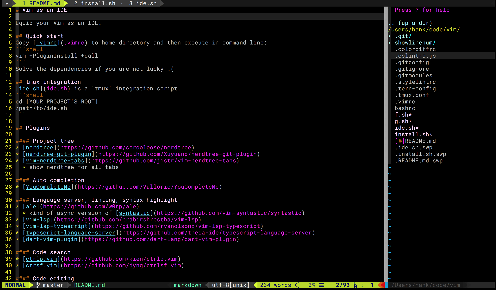

# Neovim as an IDE

Lua configuration for Neovim, managed by lazy.nvim. Requires Neovim 0.11+, Git,
a C compiler and Make for native plugins, Node.js/npm, and ripgrep for Telescope.



## Install

Install [nvm](https://github.com/nvm-sh/nvm#installing-and-updating) yourself,
then install and activate Node.js (including npm) before running setup:

```sh
nvm install --lts
```

Use Bash/Zsh for nvm, or follow its [Fish integration instructions](https://github.com/nvm-sh/nvm#fish).
The installer does not install Node.js, npm, or nvm. If `node` or `npm` is missing
from PATH, it stops before system changes and prints nvm setup guidance.

```sh
./install.sh
```

Supported systems: Linux with apt, dnf, or pacman, and macOS with
[Homebrew](https://brew.sh) already installed. Linux package installation uses
sudo unless running as root. No third-party PPAs or package-manager installers
are run. If the distro's Neovim is older than 0.11, installation stops with
[official upgrade instructions](https://github.com/neovim/neovim/blob/master/INSTALL.md).

Using your existing npm, setup installs TypeScript 7 (the configured `tsc --lsp` server), Biome, and
prettierd into `~/.local`, links the Lua configuration, and synchronizes plugins.
Add `~/.local/bin` to your shell's PATH:

```sh
# Bash/Zsh
export PATH="$HOME/.local/bin:$PATH"
# Fish
fish_add_path "$HOME/.local/bin"
```

It also installs tools used by the shared dotfiles (Fish, fzf, eza, gawk,
Tig, and Delta), plus xclip on Linux. tmux uses the login shell and
copies through pbcopy on macOS or xclip on Linux; xclip requires an X display.
It links `.gitconfig`, `.tigrc`, `.tmux.conf`, and Fish config.
Review these files before installing: `.gitconfig`
contains personal identity and aliases. Existing custom files and directories
cause a conflict; back them up or move them, then rerun. Correct existing links
are left in place. Absolute paths allow running scripts from any directory;
keep this checkout available as the source of the links.

For configuration only, with dependencies already installed:

```sh
./install_nvim.sh
```

Configuration respects `XDG_CONFIG_HOME` (defaults to `~/.config`). On first
Neovim startup, lazy.nvim downloads plugins and Mason installs configured
language servers. Run `:checkhealth` and `:Mason` to check tools; install optional
formatters/linters such as Black, isort, Ruff, and StyLua through Mason as needed.
AI plugins require their own authentication. Nerd Fonts and terminal configuration
are manual choices; setup does not install fonts or legacy terminal configs.

## Migration

`ble.sh`, `init.vim`, and the vim-plug setup are deprecated. `init.vim` remains
in the repo for reference; installers use `init.lua` and `lua/`. Remove ble.sh
source/attach lines from existing shell startup files yourself; the repository's
`bashrc` no longer includes them.

The installer removes an existing Neovim `init.vim` symlink only when it points
to this checkout's legacy file. A custom `init.vim` is preserved and blocks
installation because Neovim cannot use both entry points. Existing `~/.vimrc`
and Vim plugin data are preserved. Obsolete TSLint, ESLint bundles, vim-plug,
vimpager, and showlinenum setup are no longer installed.

colordiff and Ctags are deprecated. Setup no longer installs their packages or
links `.colordiffrc` and `default.ctags`; repository configs remain for reference.
Existing packages and home configs are preserved and do not block installation.
The colordiff-based `git dic` alias is retired; use `git di` with Delta instead.

## Verify installer

```sh
python3 -B -m unittest discover -s tests -v
```

Tests use temporary homes and mocked package managers; no real packages or
plugins are installed.
