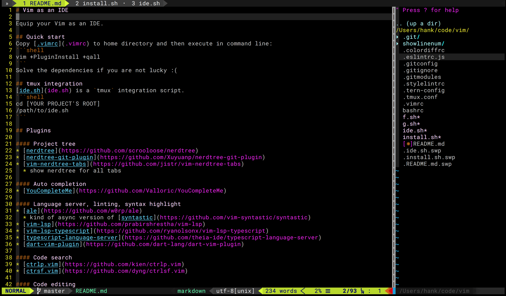

# Vim as an IDE

Equip your Vim as an IDE.


## Quick start
Vim plugin handler [vim-plug](https://github.com/junegunn/vim-plug) is used.

Just copy [.vimrc](.vimrc) to your home directory and start `vim`. All the plugins will be downloaded automatically.

To install manually, follow [vim-plug installation](https://github.com/junegunn/vim-plug#installation) first. And then execute the command:
```shell
vim +PlugInstall +qall
```
## tmux integration
Copy `.tmux.conf` to your home directory.

The following plugins are included in `.vimrc`:
* [vim-tmux-focus-events](https://github.com/tmux-plugins/vim-tmux-focus-events)
* [vimux](https://github.com/benmills/vimux)

## Plugins

#### Project tree
* [vimfiler.vim](https://github.com/Shougo/vimfiler.vim)
  * NERDTree becomes slow when rendering massive tree nodes
* [vim-devicons](https://github.com/ryanoasis/vim-devicons)
  * add icons to vimfiler
  * I use this font: [RobotoMono Nerd Font Mono](https://github.com/ryanoasis/nerd-fonts/blob/master/patched-fonts/RobotoMono/Regular/complete/Roboto%20Mono%20Nerd%20Font%20Complete%20Mono.ttf)

#### Auto completion
* [YouCompleteMe](https://github.com/Valloric/YouCompleteMe)

#### Language server, linting, syntax highlight
* [ale](https://github.com/w0rp/ale)
  * kind of async version of [syntastic](https://github.com/vim-syntastic/syntastic)
* [vim-lsp](https://github.com/prabirshrestha/vim-lsp)
* [vim-lsp-typescript](https://github.com/ryanolsonx/vim-lsp-typescript)
* [vim-lsp-javascript](https://github.com/ryanolsonx/vim-lsp-javascript)
* [typescript-language-server](https://github.com/theia-ide/typescript-language-server)
* [dart-vim-plugin](https://github.com/dart-lang/dart-vim-plugin)

#### Code search
* [ctrlp.vim](https://github.com/kien/ctrlp.vim)
* [ctrsf.vim](https://github.com/dyng/ctrlsf.vim)
* [fzf.vim](https://github.com/junegunn/fzf.vim)

#### Code editing
* [vim-prettier](https://github.com/prettier/vim-prettier)
* [nerdcommenter](https://github.com/scrooloose/nerdcommenter)
* [ultisnips](https://github.com/SirVer/ultisnips)
* [vim-snippets](https://github.com/honza/vim-snippets)
* [auto-pairs](https://github.com/jiangmiao/auto-pairs)
  * auto delete pairs
* [vim-closetag](https://github.com/alvan/vim-closetag)
* [vim-jsx-improve](https://github.com/neoclide/vim-jsx-improve)
  * without indent issue of `vim-jsx`
* [wildfire.vim](https://github.com/gcmt/wildfire.)
  * quick select group of text by SPACE
* [vim-fish](https://github.com/dag/vim-fish)
* [vim-surround](https://github.com/tpope/vim-surround)

#### Git enhancement
* [vimagit](https://github.com/jreybert/vimagit)
* [vim-gitgutter](https://github.com/airblade/vim-gitgutter)
* [git-blame.vim](https://github.com/zivyangll/git-blame.vim)
  * show commit title in status bar
* [vim-fugitive](https://github.com/tpope/vim-fugitive)
* [showlinenum](https://github.com/jay/showlinenum)
  * show line number in git-diff

#### UI
* [vim-airline](https://github.com/vim-airline/vim-airline)
* [powline fonts](https://github.com/powerline/fonts)
* [vim-indent-guides](https://github.com/nathanaelkane/vim-indent-guides)
* [tabpagebuffer.vim](https://github.com/Shougo/tabpagebuffer.vim)

#### Utils
* [flutter-reload.vim](https://github.com/hankchiutw/flutter-reload.vim)
* [instant-markdown-d](https://github.com/suan/vim-instant-markdown)
* [vimpager](https://github.com/rkitover/vimpager)
* [vim-unimpaired](https://github.com/tpope/vim-unimpaired)
* [vim-repeat](https://github.com/tpope/vim-repeat)
* [vim-bookmarks](https://github.com/MattesGroeger/vim-bookmarks)

## Install

See [install.sh](install.sh)

## Lint
Copy `.eslintrc.js` to home folder.

Copy `.stylelintrc` to project root folder.
